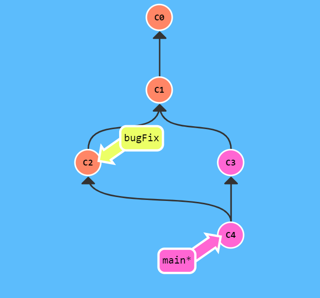
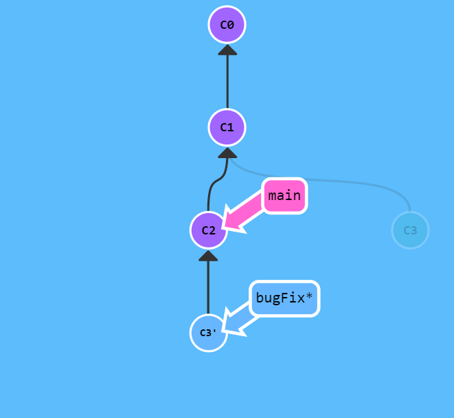
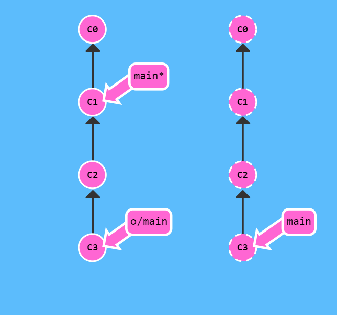
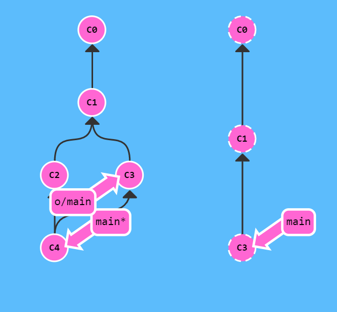
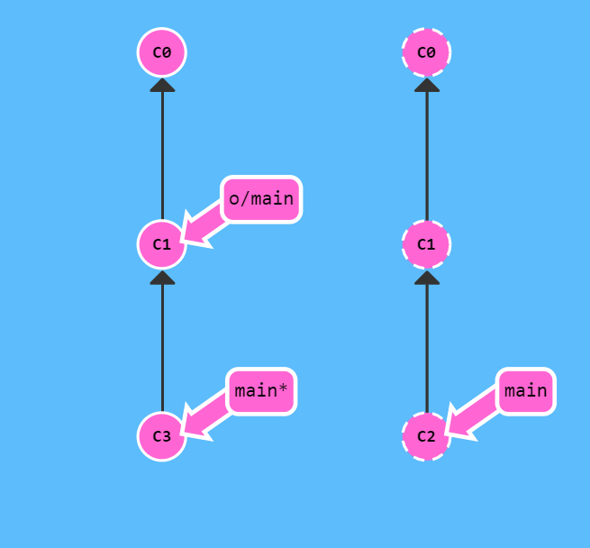
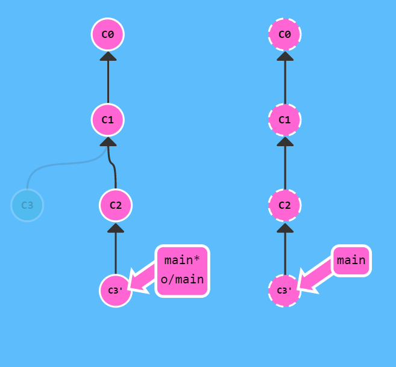
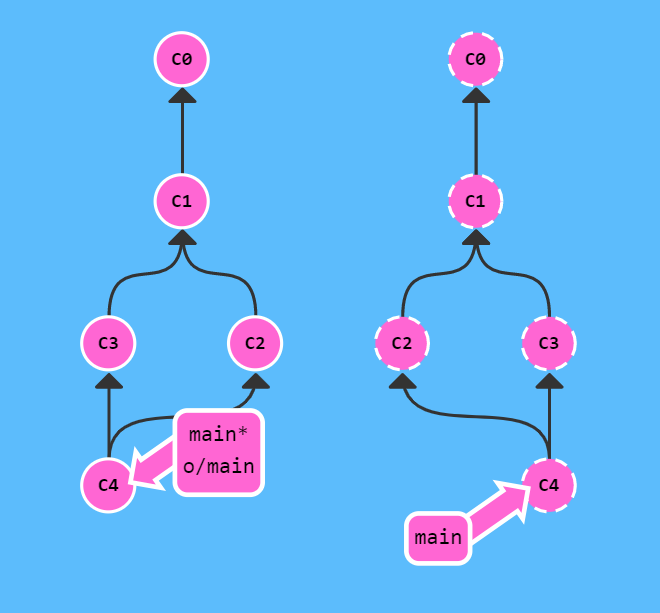

本文主要介绍了 Git 本地和远程的一些常用操作，包括 commit，branch，merge，rebase，fetch 和 push 等。

<!--more-->

## 基本操作

### Commit

Git 仓库中的提交记录保存的是你的目录下所有文件的快照。 Git 希望提交记录尽可能地轻量，因此在你每次进行提交时，它并不会盲目地复制整个目录。条件允许的情况下，它会将当前版本与仓库中的上一个版本进行对比，并把所有的差异打包到一起作为一个提交记录。 Git 还保存了提交的历史记录。

使用方法为

```
git commit -m "Some Message"
```

### Branch

Git 的分支也非常轻量。它们只是简单地指向某个提交纪录，仅此而已。因此即使创建再多的分支也不会造成储存或内存上的开销，并且按逻辑分解工作到不同的分支要比维护那些特别臃肿的分支简单多了。所以使用 Git 的一个原则就是**早建分支，多用分支**。

创建一个新的分支

```
git branch newBranch
```

切换到该分支

```
git checkout newBranch
```

上述两条命令可以由一种更简洁的方式实现

```
git checkout -b newBranch
```

### Merge

现在我们讨论如何将两个分支合并到一起。就是说我们新建一个分支，在其上开发某个新功能，开发完成后再合并回主线。完成该操作的第一种方法是 `git merge`。

例如，我们要将 bugFix 分支合并到 main 分支里，切换到 main 分支，执行

```
git merge bugFix
```

这样 main 分支就包含了对代码库的所有修改。

<center></center>

### Rebase

合并分支的第二种方法是 `git rebase`。Rebase 实际上就是取出一系列的提交记录，“复制”它们，然后在另外一个地方逐个的放下去。Rebase 的优势就是可以创造更线性的提交历史。

我们想要把 bugFix 分支里的工作直接移到 main 分支上。移动以后会使得两个分支的功能看起来像是按顺序开发，但实际上它们是并行开发的。注意当前所在的分支是 bugFix。

```
git rebase main
```

<center></center>

事实上，`git rebase` 可以添加两个参数，后面的参数默认为当前的分支。

```
git rebase <baseBranch>  <topicBranch>
```

会将 topicBranch 变基到 baseBranch 上，也就是将 topicBranch 的代码“续”到了 baseBranch 后面。

上面的命令等价于

```
git rebase main bugFix
```

这样，我们在进行 rebase 时就不需要频繁切换分支了。

我们只需要记住，rebase 时修改的是后面的分支，前面的分支不动就可以了。

### Merge 和 Rebase 的选择

那么，我们在合并分支时应该什么时候使用 rebase，什么时候使用 merge 呢？

一个基本的原则是

**sub-branches rebase on master, master merges sub-branches.**

也就是在上例中，我们如果想要将 bugFix 里的工作合并到 main 中，应当采用

```
git rebase main
git checkout main
git merge bugFix
```

## 远程仓库

### Clone

远程仓库并不复杂, 在如今的云计算盛行的世界很容易把远程仓库想象成一个富有魔力的东西, 但实际上它们只是你的仓库在另个一台计算机上的拷贝。你可以通过因特网与这台计算机通信 —— 也就是增加或是获取提交记录。话虽如此, 远程仓库却有一系列强大的特性：

- 首先也是最重要的的点, 远程仓库是一个强大的备份。本地仓库也有恢复文件到指定版本的能力, 但所有的信息都是保存在本地的。有了远程仓库以后，即使丢失了本地所有数据, 你仍可以通过远程仓库拿回你丢失的数据。
- 还有就是, 远程让代码社交化了! 既然你的项目被托管到别的地方了, 你的朋友可以更容易地为你的项目做贡献(或者拉取最新的变更)

`git clone` 命令的作用是在**本地**创建一个远程仓库的拷贝（比如从 github.com）。

当我们 clone 一个具有子模块的项目时，默认会包含该子模块目录，但其中还没有任何文件。我们必须运行两个命令：`git submodule init` 用来初始化本地配置文件，而 `git submodule update` 则从该项目中抓取所有数据并检出父项目中列出的合适的提交。

不过，还有一种更简单的方式，如果给 `git clone` 命令传递 `--recurse-submodules` 选项，它就会自动初始化并更新仓库中的每一个子模块， 包括可能存在的嵌套子模块。

### Fetch & Pull

`git fetch` 用于从远程仓库中获取数据。

`git fetch` 完成了仅有的但是很重要的两步:

- 从远程仓库下载本地仓库中缺失的提交记录
- 更新远程分支指针(如 `origin/main`)

`git fetch` 实际上将本地仓库中的远程分支更新成了远程仓库相应分支最新的状态。

<center></center>

而 `git fetch` 并不会改变你本地仓库的状态。它不会更新你的 `main` 分支，也不会修改你磁盘上的文件。

因此，我们需要执行通过以下命令来将这些变化更新到我们的工作当中。

```
git cherry-pick origin/main
git rebase origin/main
git merge origin/main
```

实际上，由于先抓取更新再合并到本地分支这个流程很常用，因此 Git 提供了一个专门的命令来完成这两个操作。它就是我们要讲的 `git pull`。`git pull` 相当于 `git fetch` 和 `git merge` 两个操作。

<center></center>

例如

```
git fetch
git merge origin/main
```

和

```
git pull
```

完全等价。

### Push

`git push` 负责将**你的**变更上传到指定的远程仓库，并在远程仓库上合并你的新提交记录。一旦 `git push` 完成, 你的朋友们就可以从这个远程仓库下载你分享的成果了！

但是，当历史偏离时 `git push` 会失败。比如你最新提交的 `C3` 基于远程分支中的 `C1`。而远程仓库中该分支已经更新到 `C2` 了，所以 Git 拒绝了你的推送请求。实际上它会强制你先合并远程最新的代码，然后才能分享你的工作。

<center></center>

那该如何解决这个问题呢？很简单，你需要做的就是使你的工作基于最新的远程分支。有许多方法可以做到这一点，不过最直接的方法就是通过 rebase 调整你的工作。

我们可以在 push 之前做 rebase

```
git fetch
git rebase origin/main
git push
```

<center></center>

当然，也可以使用 merge。尽管 `git merge` 不会移动你的工作（它会创建新的合并提交），但是它会告诉 Git 你已经合并了远程仓库的所有变更。这是因为远程分支现在是你本地分支的祖先，也就是说你的提交已经包含了远程分支的所有变化。

<center></center>

实际上，我们使用

```
git pull --rebase
git push
```

就可以更加方便地完成，这和上文的 rebase 方法完全相同。当然，如果使用 `git pull`，那么就相当于上文的 merge 方法了。

## git rm --cached

在上传文件到 Git 上时，有时候会将本地的一些配置文件传到服务器上，这时候如果先删除本地，再同步服务器显然是不合理的。这时 Git 给我们提供了一种解决方法，可以直接删除服务器文件而不影响本地。命令如下：

```
git rm --cached filename
git rm --cached -r directory
```

当我们提交并推送之后，服务器上的文件就不存在了。

---

参考链接：

1. [learngitbranching.js.org](https://learngitbranching.js.org/?locale=zh_CN)
