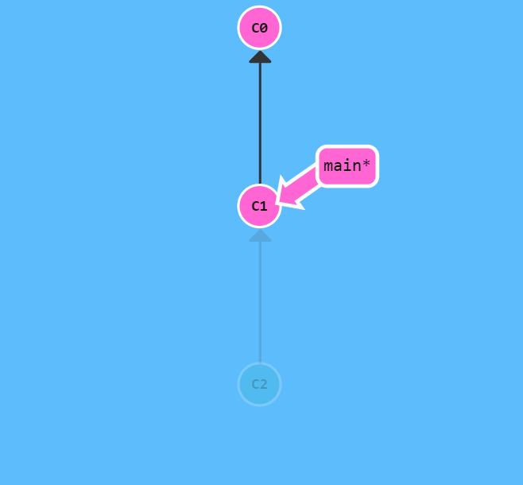
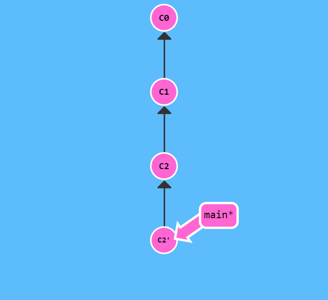
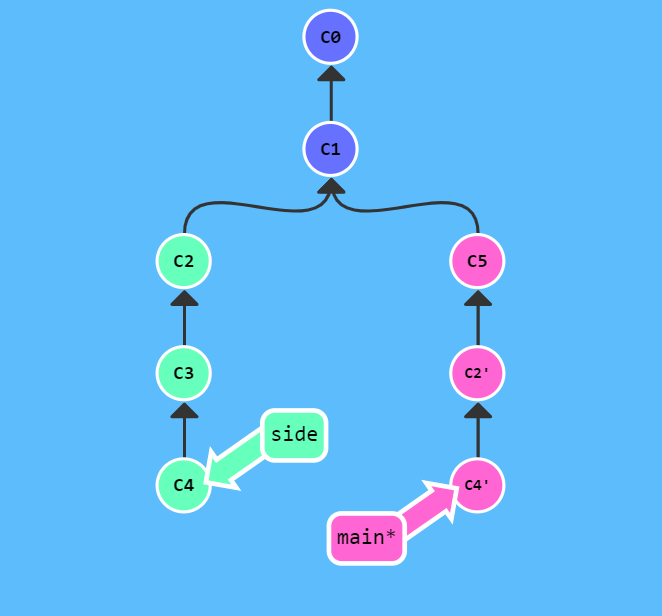
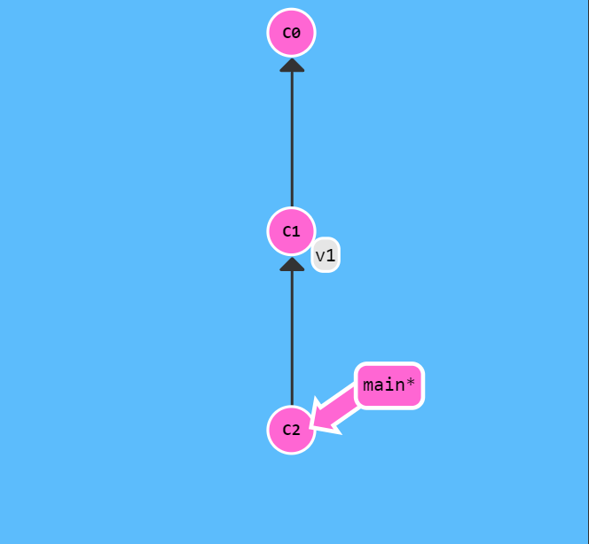
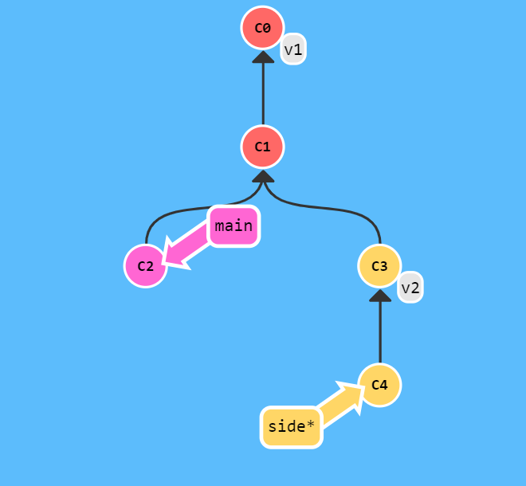

本文主要介绍了 Git 的一些进阶操作，包括分离 HEAD，相对引用，cherry-pick，交互式 rebase 和 tag 等。

<!--more-->

## 分离 HEAD

HEAD 是一个对当前检出记录的符号引用，也就是指向你正在其基础上进行工作的提交记录。HEAD 总是指向当前分支上最近一次提交记录。大多数修改提交树的 git 命令都是从改变 HEAD 的指向开始的。HEAD 通常情况下是指向分支名的（如 bugFix）。

我们可以通过 checkout 一个分支

```
git checkout bugFix
```

来使 HEAD 指向该分支，

也可以通过 chekcout 一个提交

```
git checkout C1
```

来使 HEAD 指向该提交。

## 相对引用

通过指定提交记录哈希值的方式在 Git 中移动不太方便，所以 Git 引入了相对引用。使用相对引用的话，就可以从一个易于记忆的地方开始计算。相对引用有两个常用的用法：

- 使用 `^` 向上移动 1 个提交记录
- 使用 `~<num>` 向上移动 num 个提交记录

如：

```
git checkout HEAD^
```

会向上移动 1 个提交记录。

<center></center>

我们可以通过相对引用来移动分支。使用 `-f` 选项来让分支指向另一个提交。例如：

```
git branch -f main HEAD~3
```

会将 main 分支强制指向 HEAD 的第 3 级父提交。

## 撤销变更

在 Git 中主要有两个方法来撤销变更，分别是 `git reset` 和 `git revert`。

`git reset` 通过把分支记录回退几个提交记录来实现撤销改动。你可以将这想象成“改写历史”。`git reset` 向上移动分支，原来指向的提交记录就跟从来没有提交过一样。实际上，在 reset 后，该提交所做的变更还在，但是处于未加入暂存区状态。如果我们要删除所做的更改，可以使用 `--hard` 选项。

<center></center>

虽然在你的本地分支中使用 `git reset` 很方便，但是这种“改写历史”的方法对大家一起使用的远程分支是无效的哦！为了撤销更改并**分享**给别人，我们需要使用 `git revert`。

`git revert` 会在要撤销的提交后面新增一个提交，新提交的更改正是为了撤销上一个提交。因此 revert 之后我们就可以将更改推送到远程仓库与别人分享了。

<center></center>

## Cherry-pick

`git cherry-pick` 是整理提交记录的第一种方法。

cherry-pick 可以将一些提交复制到当前所在的位置（HEAD）下面，如 side 分支上有 C2，C3，C4 三个提交，而我们只想将其中两个复制到 main 分支，就可以

```
git cherry-pick C2 C4
```

<center></center>

## 交互式 rebase

当你知道你所需要的提交记录（**并且**还知道这些提交记录的哈希值）时, 用 cherry-pick 再好不过了。但是如果你不清楚你想要的提交记录的哈希值呢? 那么这时我们可以利用交互式的 rebase——如果你想从一系列的提交记录中找到想要的记录, 这就是最好的方法了。

交互式 rebase 指的是使用带参数 `--interactive` 的 rebase 命令, 简写为 `-i`。如果你在命令后增加了这个选项, Git 会打开一个 UI 界面并列出将要被复制到目标分支的备选提交记录，它还会显示每个提交记录的哈希值和提交说明，提交说明有助于你理解这个提交进行了哪些更改。

交互式 rebase 的界面如下例所示：

```
pick f7f3f6d Change my name a bit
pick 310154e Update README formatting and add blame
pick a5f4a0d Add cat-file

# Rebase 710f0f8..a5f4a0d onto 710f0f8
#
# Commands:
# p, pick <commit> = use commit
# r, reword <commit> = use commit, but edit the commit message
# e, edit <commit> = use commit, but stop for amending
# s, squash <commit> = use commit, but meld into previous commit
# f, fixup <commit> = like "squash", but discard this commit's log message
# x, exec <command> = run command (the rest of the line) using
# b, break = stop here (continue rebase later with 'git rebase --continue')
# d, drop <commit> = remove commit
# l, label <label> = label current HEAD with a name
# t, reset <label> = reset HEAD to a label
# m, merge [-C <commit> | -c <commit>] <label> [# <oneline>]
# .       create a merge commit using the original merge commit's
# .       message (or the oneline, if no original merge commit was
# .       specified). Use -c <commit> to reword the commit message.
#
# These lines can be re-ordered; they are executed from top to bottom.
#
# If you remove a line here THAT COMMIT WILL BE LOST.
#
# However, if you remove everything, the rebase will be aborted.
#
# Note that empty commits are commented out
```

在交互式 rebase 的界面中，我们可以

- 修改提交顺序。只需在编辑器中修改各行的顺序即可。
- 合并提交。我们可以将多个提交合并到一个提交中。方法是将想要的提交设置为 `pick`，而将想要合并的提交设置为 `squash`。保存后会出现一个新的编辑器窗口，在这里面可以修改提交信息。
- 拆分提交。我们也可以将一个提交拆分成多个提交。方法是将想要拆分的提交设置为 `edit`，保存退出后 git 会提示在该提交处停止了。这里可以用 `git commit --amend` 命令对提交信息重新编辑。而我们是要拆分提交，所以要先将提交 reset，然后重新提交。拆分完成后使用 `git rebase --continue` 结束 rebase。
- 删除提交。方法是在编辑器中直接删除那一行，保存退出后 git 会比较其前后两个提交的差异，如果有冲突需要手动解决冲突之后再 `git rebase --continue`。

## Tag

我们知道，分支很容易被人为移动，并且当有新的提交时，它也会移动。分支很容易被改变，大部分分支还只是临时的，并且还一直在变。那么有没有什么可以*永远*指向某个提交记录的标识呢，比如软件发布新的大版本，或者是修正一些重要的 Bug 或是增加了某些新特性。 Git 的 Tag 正是这个用途。

它们可以永久地将某个特定的提交命名为里程碑，然后就可以像分支一样引用了。更难得的是，它们并不会随着新的提交而移动。你也不能检出到某个标签上面进行修改提交，它就像是提交树上的一个锚点，标识了某个特定的位置。

```
git tag v1 C1
```

就将 C1 提交记录标记为了 1.0 版本。

<center></center>

## Describe

`git describe`的语法是

```
git describe <ref>
```

`<ref>` 可以是任何能被 Git 识别成提交记录的引用，如果你没有指定的话， Git 会以你目前所检出的位置（`HEAD`）。

它输出的结果是这样的：

```
<tag>_<numCommits>_g<hash>
```

`tag` 表示的是离 `ref` 最近的标签，`numCommits` 是表示这个 `ref` 与 `tag` 相差有多少个提交记录，`hash` 表示的是你所给定的 `ref` 所表示的提交记录哈希值的前几位。当 `ref` 提交记录上有某个标签时，则只输出标签名称。

例如，对于下面的提交树

<center></center>

`git describe main` 会输出：

```
v1_2_gC2
```

`git describe side` 会输出：

```
v2_1_gC4
```

---

参考链接：

1. [learngitbranching.js.org](https://learngitbranching.js.org/?locale=zh_CN)
