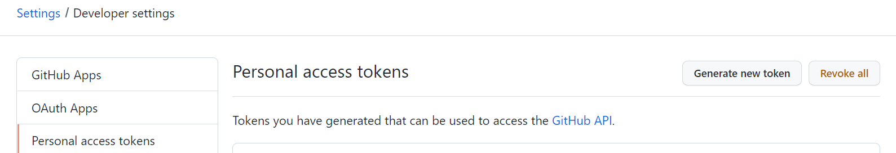
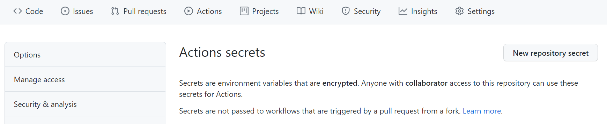

本文主要介绍了如何利用 Hugo 和 Github Pages 创建静态博客，并利用 Github Actions 实现博客的自动部署。

<!--more-->

## 背景介绍

### Hugo

Hugo 是一个用 Go 编写的静态网站生成器，Hugo 一般只需几秒钟就能生成一个网站（每页少于 1 毫秒），被称为“世界上最快的网站构建框架”。这也使 Hugo 大受欢迎，成为最热门的静态网站生成器之一，被广泛采用。

静态博客最常用的两个框架就是 Hugo 和 Hexo。由于 Hexo 是由 Node.js 编写，在文章数量较大之后就需要比较长的编译时间，因此由于性能考虑我们采用 Hugo 作为我们博客的框架。

### Github Pages

GitHub Pages 是 GitHub 提供的一个免费网页寄存服务，可以用于存放静态网页，包括博客、项目文档甚至整本书。利用 Github Pages 部署静态博客，就可以免去部署服务器的费用，减少成本。不过，静态博客由于没有数据库，因此在后台管理方面就不如动态博客（如 WordPress 等）方便。

### Github Actions

Github Actions 提供了免费的 CI/CD 功能，能够帮助我们自动完成软件开发周期内的任务。 GitHub Actions 是事件驱动的，意味着可以在指定事件发生后运行一系列命令。 例如，每次有人为仓库创建拉取请求时，都可以自动运行命令来执行软件测试脚本。

利用 Github Actions，我们就可以实现博客的自动部署。每当我们对仓库完成 push 操作时，Github 就能自动进行编译并完成静态文件的部署。

## 博客建立

我们首先下载 [Hugo](https://github.com/gohugoio/hugo/releases)，推荐下载 extended 版本。解压并设置好环境变量后，打开终端，输入

```
hugo new site Blog
```

这样就建立了一个新的博客。

我们可以建立一篇新的文章。

```
hugo new posts/first-post/index.md
```

这样，就会在 `Blog/content/posts/first-post/`下生成一个名为 `index.md`的文件。

编写完博客之后，我们可以通过

```
Hugo server -D
```

来对网站进行实时预览，以及通过

```
Hugo
```

来将网站进行编译。

## 选择主题

我推荐的主题是 [PaperMod](https://github.com/adityatelange/hugo-PaperMod) 主题。我们可以通过此命令来安装该主题

```
git submodule add https://github.com/adityatelange/hugo-PaperMod.git themes/PaperMod --depth=1
```

而当我们重新 clone 我们的仓库时，如果主题没有自动下载，需要运行以下命令

```
git submodule update --init --recursive # needed when you reclone your repo (submodules may not get cloned automatically)
```

具体的配置可以参照仓库的 Wiki，这里简单介绍以下如何添加归档和搜索页面。

在 `Blog/contend/` 下创建 `archives.md` 和 `search.md`，内容分别为：

archives.md

```markdown
---
title: "Archive"
layout: "archives"
url: "/archives"
summary: "archives"
---
```

search.md

```markdown
---
title: "Search"
layout: "search"
summary: "search"
---
```

然后修改 `config.yml` 配置文件，将 `menu` 部分改为

```yaml
menu:
  main:
    - name: Archives
      url: archives
      weight: 10
    - name: Categories
      url: categories/
      weight: 20
    - name: Tags
      url: tags/
      weight: 30
    - name: Search
      url: search/
      weight: 40
```

这样博客就有了归档和搜索页面。

## 建立远程仓库

我们在 Github 上建立名为 `username.github.io` 的仓库，然后将本地的博客与远程仓库的 `source` 分支对应，添加 `.gitignore` 文件后就可以将文件都推送到该分支了。而 `main` 分支作为我们 Pages 展示的分支，暂时留空，它将在后面由 Github Actions 自动生成并部署。

## 使用脚本简化操作

我们可以通过 脚本来简化博客的操作。

首先是部署的脚本 `deploy.sh`

```bash
#!/bin/

# 添加所有修改
git add .

# 设置提交说明，格式为 Site updated: 2006-01-02 15:04:05
time=$(date "+%Y-%m-%d %H:%M:%S")
commit="Site updated:"$time
echo $commit

# 提交
git commit -m "$commit"

# 推送到source分支上
git push origin source
```

然后修改 `.zshrc` 文件，添加几个简写

```
# Hugo
export BLOG_HOME="$HOME/Blog"
alias hs="cd $BLOG_HOME && hugo server -D"
alias hd="cd $BLOG_HOME && sh deploy.sh"
alias hb="cd $BLOG_HOME && rm -rf public/* && hugo"
hn() {
    cd $BLOG_HOME && hugo new posts/$1/index.md
}
```

这样，我们就可以通过 `hs` 实现预览，通过 `hb` 实现博客编译，通过 `hd` 实现博客部署，通过 `hn new-post` 创建新的博文了。

## Github Actions 自动部署

首先，我们要先在 Github 上申请一个 personal access token。选择 Token 的作用域时可以根据需要选择，也可以直接全选。完成后 Github 会提供一个 Token，注意该 Token 只会出现一次，我们需要保存好，如果忘记就只能重新申请了。

<center></center>

插一句题外话，实际上，由于 Github 现在已经不再支持密码验证，当我们进行 push 操作时同样也需要 Token。为了简便，我们可以将仓库的远程地址换成 `https://<token>@github.com/user/repo.git`，这样在 push 时就不需要要求验证了。

然后在远程仓库的 `Settings/Secrets` 中添加你的 Personal access token。

<center></center>

最后在本地仓库中新建 `Blog/.github/workflows/gh-pages.yml` 文件

```yaml
name: github pages

on:
  push:
    branches:
      - source # Set a branch to deploy

jobs:
  deploy:
    runs-on: ubuntu-20.04
    steps:
      - uses: actions/checkout@v2
        with:
          submodules: recursive # Fetch Hugo themes (true OR recursive)
          fetch-depth: 0 # Fetch all history for .GitInfo and .Lastmod

      - name: Setup Hugo
        uses: peaceiris/actions-hugo@v2
        with:
          hugo-version: "latest"
          extended: true

      - name: Build
        run: hugo --minify

      - name: Deploy
        uses: peaceiris/actions-gh-pages@v3
        with:
          github_token: ${{ secrets.ACTIONS_TOKEN }}
          publish_dir: ./public
          publish_branch: main
          cname: your_domain
```

注意需要将 github_token 的名称改为你仓库中 token 的名字，并将 cname 换成你自己的域名，如不需要更换也可以删除。更换后也需要到域名的 DNS 管理处添加 CNAME 到 username.github.io。

并且，Github 还会自动为我们申请 SSL 证书，我们可以到仓库的 Github Pages 设置页面打开 HTTPS 访问。

这样，每当我们将源码推送到 `source` 分支后，Github 就会自动就编译后的静态文件部署到 `main` 分支并发布到 Github Pages 中了。

## 从远程仓库下载

当我们更换了一台新的电脑或是本地仓库被损坏时，可以从远程仓库中下载博客。为了下载博客的主题，需要添加 `--recurse-submodules` 参数。

```
git clone username.github.io --recurse-submodules
```
